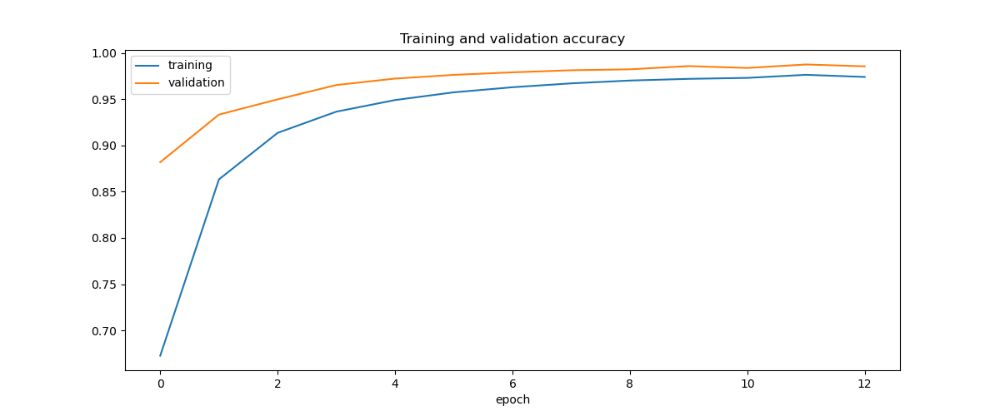
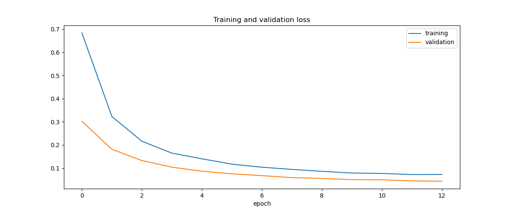
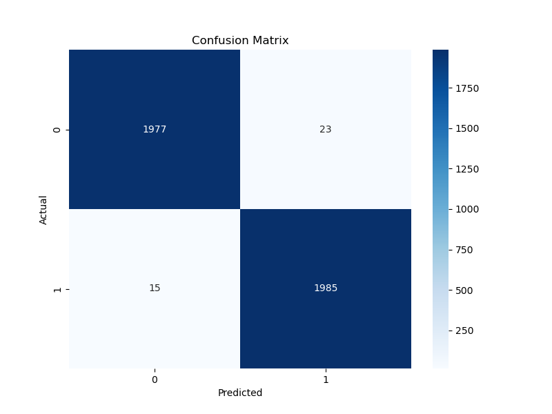

# Violence Detection in Videos

This project implements a real-time violence detection system using MobileNetV2, a lightweight convolutional neural network architecture. The system analyzes video frames and classifies content as either "Violence" or "Non-Violence" with high accuracy.

## Overview

The violence detection system works by:

1. Extracting frames from videos
2. Processing frames through a trained MobileNetV2 model
3. Classifying each frame as violent or non-violent
4. Providing real-time visual feedback on processed videos

## Data Collection

The data used was data provided by Kaggle. The data is largely divided into Violence and NonViolence for 1000 images each.

[Real Life Violence Situations Data](https://www.kaggle.com/mohamedmustafa/real-life-violence-situations-dataset)

## Model

MobileNetV2 is used to with improved accuracy and predictions. It was chosen in order to be deployed for Raspberry Pi and Android.

## Project Structure

```
.
├── data/                            # Directory for extracted frames
│   ├── Violence/                   # Frames from violent videos
│   └── NonViolence/                # Frames from non-violent videos
├── model/                          # Directory for saved models
│   ├── model.h5                    # Complete trained model
│   └── ModelWeights.h5             # Model weights only
├── video/                          # Source videos for training
│   ├── Violence/                   # Violent video clips
│   └── NonViolence/                # Non-violent video clips
├── input/                          # Directory for videos to be processed
├── output/                         # Directory for processed output videos
├── logs/                           # Serves for monitoring and visualizing the model
│   ├── fit                         # Timestamped log directory
├── images/                         # Training visualizations
│   ├── accuracy.png                # Training/validation accuracy graph
│   ├── loss.png                    # Training/validation loss graph
│   └── confusion_matrix.png        # Confusion matrix visualization
├── mobilenetv2-model-collab.ipynb  # Model training script
├── extract_frames_from_video.ipynb # Script to extract frames from videos
├── predict_video.ipynb             # Script to process and analyze videos
├── environment.yml                 # Conda environment specification
├── requirements.txt                # Python dependencies
└── README.md                       # This file
```

## Performance

The trained model achieves:

- **Overall accuracy**: ~96.6%
- **Violence detection accuracy**: ~97.1%
- **Non-violence detection accuracy**: ~96.1%





## Output

Output is in the form of a video, which will tell violence/ non-violence on the top left corner.


## How to Start

### Prerequisites

- Python 3.10
- TensorFlow 2.10.0
- OpenCV 4.6.0
- NumPy 1.26.4
- Pandas 2.2.3
- Matplotlib 3.10.0
- scikit-learn 1.6.1
- scikit-image 0.24.0
- imgaug 0.4.0
- imutils 0.5.4
- CUDA Toolkit 11.2 with cuDNN 8.1.0 (for GPU acceleration)

### Installation

```bash
# Clone the repository
git clone https://github.com/yourusername/violence-detection.git
cd violence-detection

# Option 1: Using pip
pip install -r requirements.txt

# Option 2: Using conda
conda env create -f environment.yml
conda activate CCDEPLRL_PROJECT
```

### Data Preparation

1. Place violence and non-violence videos in the kaggle dataset in their respective directories under `video/`
2. Run the frame extraction script:

```bash
python extract_frames_from_video.py
```

### Training the Model

```bash
python mobilenetv2-model-collab.py
```

### Processing Videos

1. Place videos to be analyzed in the `input/` directory
2. Run the prediction script:

```bash
python predict_video.py
```

3. Processed videos will be saved in the `output/` directory

## Model Architecture

The system uses MobileNetV2 with the following modifications:

- Input shape: 128x128x3 (Also change the predict_video image size to match the model)
- Global Average Pooling
- Dropout (0.4) for regularization
- Dense output layer with sigmoid activation
- L2 regularization (0.0005)
- Binary cross-entropy loss function
- Adam optimizer with dynamic learning rate

## Performance Optimization

- Resizing image from 128 to 224/256 (Also change the predict_video image size to match the model)
- Batch size can be increased from 32 to 64/128 (speeds up epoch)
- Change the alpha parameter from 0.75 to 1.0 (to utilize full model)
- Change the layer.trainable from false to true (to help fine tuning the model)
- Utilize the full dataset from 10000 to all the extracted frames (more date better generalization)
- Increase patience from 5 to 10-20 (better converge)
- Increase epoch from 50 to between 50-100 (better converge)
